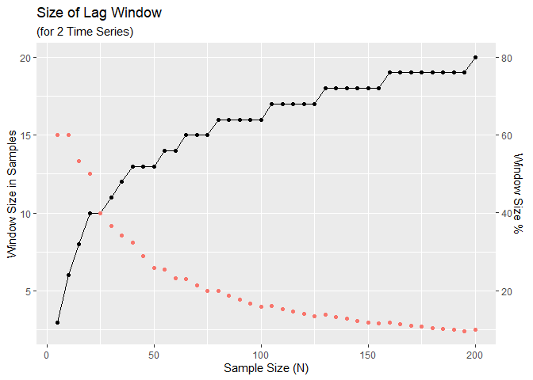
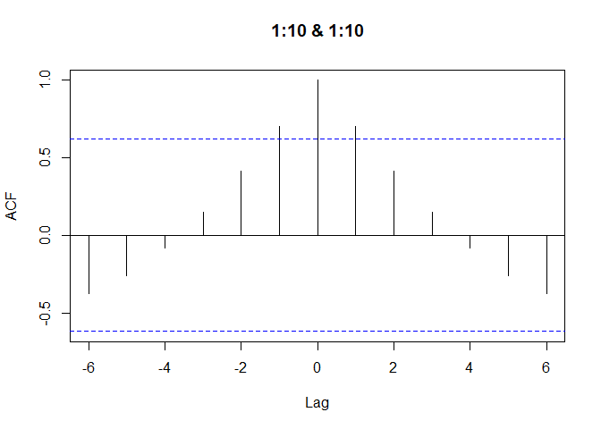
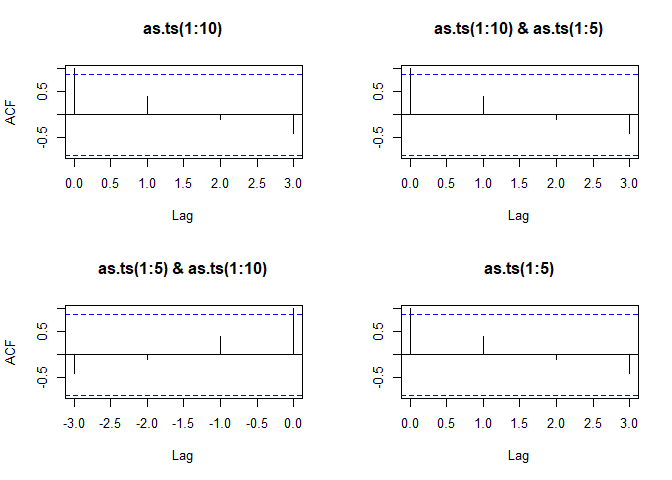
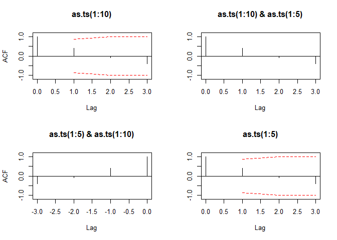

Understanding R’s Cross Correlation ccf
================

## Understanding the R Cross Correlation Function

I wanted to use the `ccf` function in a project. I had so much trouble
understanding it’s output. The documentation is rather scarce. Reading
it carefully did not help me. I had to experiment with the function and
write it down for myself. Maybe, what helped me, may help you, too.

## Cross Correlations

`ccf(x, y)` expects two vectors.

The function estimates the correlation between `x[t+k]` and `y[t]`.
Furthermore, usually we do not just specify one value of k move it in
order to see, how the correlations change and to find one value of k at
which the correlation is highest or lowest. That is exactly what `ccf()`
does.

## `ccf` as implemented in R

**Lagging behind**. Then I was wondering, why I get so few values back.
If you cross-correlate two vectors each 100 values long, all you are
going to get is a result of 33 values. They range from `k = -16` to `k =
+16`.

The second thing is the range of lags the function will explore. The
default is set to `10*log10(N/m)` where `N` is the number of
observations and `m` the number of series. That means we get a rather
small window of of lags. With a sample size of `N = 20` the lag window
is 50% which means cross-correlations will computed from -25 to +25% of
the total range. As you can see in the plot below that window gets
smaller and smaller with increasing cample size. R seems to be
determined to use as much data as possible for her computations.

You can overwrite the default setting using the `lag.max` argument.

<!-- -->

**Time series analysis**. When I finally understood the range better, I
started to wonder about the results that I got. Look at that example:

``` r
ccf(1:10, 1:10, plot = TRUE)
```

<!-- -->

When I cross-correlate two monotonously increasing sequences, why would
I not get a correlation of `r=1` for all time lags? When you simply
correlate two identical linear increasing sequences, we should always
get a correlation of 1. Should we not? Depends.


The first thing we have to understand is that `ccf` will not treat your
input as just another vector. It will interpret it as time series. What
brief introductions about cross-correlations often ignore are the
assumptions that come along with that. We can reduce the
cross-correlation to a formula a correlation between two sequences
displaced relative to one another. And that is what you can read in many
places. Wikipedia actually even covers the issue. Others do not (see
e.g. [Bourke (1996)](http://paulbourke.net/miscellaneous/correlate/)).
But along with the time series comes the stationarity assumption. That
means that the process creating the sequence is not supposed to change.
But then, neither should the variance. That is why `ccf` uses the
standard devations and means of the **whole sequence** even if it
computes the lagged cross-correlation over a limited time window.

One might argue that you could use only the data of each time window to
compute the standard deviations if they should not change. But, of
course, a sample will always introduce random fluctuation. The larger
the sample, the better the estimate. That is why R does it the way it
does it. And that is why we get weird phenomena when doing
`ccf(1:10, 1:10)`. In our case the total mean is larger than the
windowed mean for all `k != 0`. The larger `k` is, the more the values
are pulled down leading to decreasing cross-correlations on the outer
edges.

I believe that is also the reason, why R chooses rather large windows.
The larger the sample to get a cross-correlation with respect to the
total size, the less artefacts can we expect.

<!--
$$ 
r_t = {\sum_{t=max(1,−k)}^{min(N−t,N)} {(x_t - \bar x) \cdot (y_ {t-k} - \bar y)} 
\over 
{\sum_{t=max(1,−k)}^{min(N−t,N)}  {(x_t - \bar x)^2 \cdot \sum_{t=max(1,−k)}^{min(N−t,N)} (y_ {t-k} - \bar y)^2}}}
$$
-->

**Confidence**. You may have noticed the blue lines in the
cross-correlation plot above. These give you the confidence intervals.
Choose a sequence with the same distribution and more samples, it will
become smaller. The manual recommends caution with that, even though
`ci.type = "white"` is the default setting. It bluntly adds some
confidence based on the quantiles of a standard normal distribution but
it does not take the statistical properties of your data into account.
Instead it recommends `ci.type = "ma"`. If I understand it correctly, we
cannot use this type for cross-correlations. If you try it, you will get
a warning saying “can use ci.type=”ma" only if first lag is 0". It only
seems to work for auto-correlations with `acf`. This function does not
move the window from -k to +k and will allow the first lag to be zero.
`ccf` does not.

**Output**. Besides the plot, `ccf` provides a list (of class `acf`)
with the following elements:

|        |                                                                                                                                              |
| :----- | :------------------------------------------------------------------------------------------------------------------------------------------- |
| lag    | A three dimensional array containing the lags at which the cross-correlation is estimated.                                                   |
| acf    | An array with the same dimensions as lag containing the estimated cross-correlation. See below.                                              |
| type   | The type of correlation (same as the type argument).                                                                                         |
| n.used | The number of observations in the time series.                                                                                               |
| series | The name of the series x. For cross-correlations always `X` and, thus, uninformative.                                                        |
| snames | The series names for a multivariate time series. This is simply the name of the variable or the command that you used when you called `ccf`. |

This class is used for both, auto- and cross-correlations. The name of
the list element `acf` is one of the peculiarties that come alone with
that. Therefore, `ccf` creates a 3-dimensional array, so that the object
is consistent with `acf` results. The cross-correlations are stored in
`acf[,,1]`. The first two dimensions are not needed for
cross-correlations. We can just ignore them.

Look up the lags in the same way.

**Sequence length**. The element `n.used` in the `acf`-object gives you
the sample size that was used in the computation of the
cross-correlation. Usually, this will just be the length of the input
vectors. You can, however, pass vectors with different lengths to `ccf`.
In this case, `n.used = min(length(x), length(y))` because the function
ignores all values that exceed the smaller length. Why it does it that
way, I do not know. It could move the smaller sequence from the left to
the right completely covering the longer sequence.


<!--
$$
r_3 = (6-8)\cdot(8-5.5) + (7-8)\cdot(9-5.5) + (8-8)\cdot(10-5.5) \over (...)
$$
-->

What happened is this:

``` r
# Bind time series restricting to the time covered by all the series.
ts.intersect(as.ts(1:10), as.ts(1:5))
```

    ## Time Series:
    ## Start = 1 
    ## End = 5 
    ## Frequency = 1 
    ##   as.ts(1:10) as.ts(1:5)
    ## 1           1          1
    ## 2           2          2
    ## 3           3          3
    ## 4           4          4
    ## 5           5          5

As you can see, R simply cuts the longer sequence off. What you want to
get is `ccf(1:10, 1:5)`. What you actually get is `ccf(1:5, 1:5)`. The
task of `ts.intersect()` is to combine the two sequences to a data
frame. All columns of a data frame must have the same length and R must
decide whether to cut one sequence (`ts.intersect()`) or to fill the
shorter sequence with a dummy value (`ts.union()` uses `NA`).

This leads us back to the confidence interval. What we can learn from
the above is how closely `acf()` and `ccf()` are related. What more or
less happens when we call \`\`ccf()’’ is:

``` r
acf(ts.intersect(as.ts(1:10), as.ts(1:5)))
```

<!-- -->

This organises the results in a different way, but they are essentially
the same.

``` r
acf(ts.intersect(as.ts(1:10), as.ts(1:5)), ci.type = "ma", ci.col = "red")
```

<!-- -->

## Summary

It was a hard piece of work to put all this together. The fact tha R
handles cross- and auto-correlations with the same set of function adds
unnecessary compelexity. I understand that these may use the same
underlying code. But usage should not be affected by it. Unfortunately,
the documentation does not explain the complexity. It could be improved.
So could the messages. I anyone from the R team reads this, contact me
if you are interested in my suggestions.

## References

Bourke, P. (1996). [Cross Correlation: AutoCorrelation – 2D Pattern
Identification](http://paulbourke.net/miscellaneous/correlate/).

Venables, W.N., & Ripley, B.D. (2002). [Modern Applied Statistics with
S](https://www.springer.com/gp/book/9780387954578). Fourth edition.

## Session Info

``` r
print(sessionInfo(), local = FALSE)
```

    ## R version 3.6.3 (2020-02-29)
    ## Platform: x86_64-w64-mingw32/x64 (64-bit)
    ## Running under: Windows 10 x64 (build 18362)
    ## 
    ## Matrix products: default
    ## 
    ## attached base packages:
    ## [1] stats     graphics  grDevices utils     datasets  methods   base     
    ## 
    ## other attached packages:
    ## [1] ggplot2_3.3.0
    ## 
    ## loaded via a namespace (and not attached):
    ##  [1] Rcpp_1.0.3       knitr_1.28       magrittr_1.5     tidyselect_1.0.0
    ##  [5] munsell_0.5.0    colorspace_1.4-1 R6_2.4.1         rlang_0.4.5     
    ##  [9] stringr_1.4.0    dplyr_0.8.4      tools_3.6.3      grid_3.6.3      
    ## [13] gtable_0.3.0     xfun_0.12        withr_2.1.2      htmltools_0.4.0 
    ## [17] assertthat_0.2.1 yaml_2.2.1       digest_0.6.25    tibble_2.1.3    
    ## [21] lifecycle_0.2.0  crayon_1.3.4     farver_2.0.3     purrr_0.3.3     
    ## [25] glue_1.3.1       evaluate_0.14    rmarkdown_2.1    labeling_0.3    
    ## [29] stringi_1.4.6    compiler_3.6.3   pillar_1.4.3     scales_1.1.0    
    ## [33] pkgconfig_2.0.3
