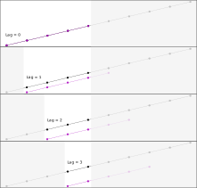

```{r, include = FALSE}
knitr::opts_chunk$set(
  collapse = TRUE,
  comment = "#>"
)
```

```{r setup, include = FALSE}
library(ccf21)
library(kableExtra)
```

## Cross Correlations in R

I wanted to use the [`ccf` function](https://rdrr.io/r/stats/acf.html) in a project, but I had a lot of trouble understanding its output. The documentation was quite limited, and even after reading it thoroughly, I still struggled. I had to experiment with the function and take notes to fully grasp how it works. Hopefully, what I learned can help you as well.

## Cross Correlations

`ccf(x, y)` expects two vectors and estimates the correlation between `x[t+k]` and `y[t]`. Typically, we don't specify just one value of `k`. Instead, we vary `k` to observe how the correlations change and identify the value where the correlation is highest or lowest. This is exactly what `ccf()` does.

## `ccf` as implemented in R

**Lagging behind**. I wondered why I was getting so few values in return. When you cross-correlate two vectors, each with 100 values, the result is just 33 values, ranging from `k = -16` to `k = +16`.

The point to consider is the range of lags `k` the function explores. By default, this is set to `10*log10(N/m)`, where `N` is the number of observations and `m` is the number of series. This results in a relatively small lag window. For example, with a sample size of `N = 20`, the lag window covers 50%, meaning cross-correlations are computed from -25% to +25% of the total range. As shown in the plot below, the relative window shrinks as the sample size increases. Though the absolute window grows, in relation to the total length of the sequence, the window shrinks. R seems to prioritize using as much data as possible for its calculations.

You can override this default setting using the `lag.max` argument.

```{r Relative size of lag window, echo=FALSE, fig.width=7}
library(ggplot2)
Lag <- seq(5, 200, 5)
Lag <- data.frame(N = Lag, Win = floor(10*log10(Lag/2)), WinPerc = floor(10*log10(Lag/2))/Lag)
ggplot( Lag, aes(x=N, y=Win)) +
  geom_line() + geom_point() + 
  ylab("Window Size in Samples") +
  geom_point(mapping = aes(x = N, y = WinPerc*25, col = "")) + 
  scale_y_continuous( sec.axis = sec_axis(~ . * 4, name = "Window Size %") ) +
  theme_light() +
  theme(legend.position = "none") + 
  labs(title = "Size of Lag Window", subtitle = "(for 2 Time Series)") +
  xlab("Sample Size (N)")
```

**Time series analysis**. When I finally understood the range better, I began to question the results I was getting. Consider this example:

```{r Simple-CCF, fig.width=7}
stats::ccf(1:10, 1:10, plot = TRUE)
```

If I cross-correlate two monotonically increasing sequences, why don't I get a correlation of `\r = 1` for all time lags? Look at the next image: When we simply correlate two identical, linearly increasing sequences, shouldn't the correlation always be 1? Well, it depends.

{width="100%"}

The first thing to understand is that `ccf` does not just treat your input as regular vectors --- it interprets them as time series. What many introductory explanations of cross-correlation fail to mention are the underlying assumptions that come with this. While cross-correlation is often simplified as the correlation between two sequences shifted relative to one another, there's more to it. Wikipedia covers this issue, but some sources do not (see, for example, [Bourke (1996)](http://paulbourke.net/miscellaneous/correlate/) or the R manual).

One key assumption with time series is *stationarity*. This means that the process generating the sequence should not change over time, and neither should the variance. This is why `ccf` uses the standard deviations and means of the **entire sequence**, even when calculating the lagged cross-correlation over a limited window.

One might suggest using only the data from each time window to compute the standard deviations, since they are not supposed to change. However, samples inherently introduce random fluctuations. The larger the sample, the more accurate the estimate, which is why R handles it this way. This also explains the odd behaviour we see with `ccf(1:10, 1:10)`. In this case, the overall mean is higher than the windowed mean for all `k ≠ 0`. As `k` increases, the values are pulled down, resulting in decreasing cross-correlations at the edges.

This is probably why R selects relatively large windows. The larger the sample relative to the total size, the fewer artefacts we can expect in the cross-correlation results.

```{=html}
<!--
$$ 
r_t = {\sum_{t=max(1,−k)}^{min(N−t,N)} {(x_t - \bar x) \cdot (y_ {t-k} - \bar y)} 
\over 
{\sum_{t=max(1,−k)}^{min(N−t,N)}  {(x_t - \bar x)^2 \cdot \sum_{t=max(1,−k)}^{min(N−t,N)} (y_ {t-k} - \bar y)^2}}}
$$
-->
```
**Confidence**. You may have noticed the blue horizontal lines in the cross-correlation plot above --- these represent the confidence intervals. If you use a sequence with the same distribution but more samples, the intervals will become narrower. However, the manual advises caution with this, which is a little strange because `ci.type = "white"` is the default. In essence: do not trust the default. This setting simply adds confidence intervals based on quantiles of the standard normal distribution, without considering the specific statistical properties of your data. The manual suggests using `ci.type = "ma"` instead, but it appears this option can't be applied to cross-correlations. If you try, you'll get a warning: "can use ci.type='ma' only if first lag is 0." This method only works for auto-correlations (`acf`), where the window doesn't shift from `-k` to `+k` and the first lag can be zero --- something `ccf` does not support.

**Output**. In addition to the plot, `ccf` returns a list (of class `acf`) with the following elements:

|        |                                                                                                                                              |
|:--------------|:--------------------------------------------------------|
| lag    | A three dimensional array containing the lags at which the cross-correlation is estimated.                                                   |
| acf    | An array with the same dimensions as lag containing the estimated cross-correlation. See below.                                              |
| type   | The type of correlation (same as the type argument).                                                                                         |
| n.used | The number of observations in the time series.                                                                                               |
| series | The name of the series x. For cross-correlations always `X` and, thus, uninformative.                                                        |
| snames | The series names for a multivariate time series. This is simply the name of the variable or the command that you used when you called `ccf`. |

This class is used for both auto- and cross-correlations, which leads to some peculiarities. For example, the list element is still named `acf`, even for cross-correlations. To maintain consistency with `acf` results, `ccf` creates a 3-dimensional array. The actual cross-correlation values are stored in `acf[,,1]`. The first two dimensions aren't necessary for cross-correlations, so we can simply ignore them.

**Sequence Length**. The element `n.used` in the `acf` object shows the sample size used in the cross-correlation computation, which is typically just the length of the input vectors. However, you can pass vectors of different lengths to `ccf`. In that case, `n.used = min(length(x), length(y))`, as the function ignores any values beyond the length of the shorter vector. The reason for this approach is unclear, as it could, in theory, shift the shorter sequence across the full length of the longer one.

{width="100%"}

What happens is this:

```{r Binding time series}
# Bind time series restricting to the time covered by all the series.
ts.intersect(as.ts(1:10), as.ts(1:5))
```

The statement mentioned above is found early in the `ccf` function (line 7 of the stats package, version 4.4.1). It prepares the data before passing it to another function (i.e. `acf`) that performs the actual computation. As you can see, R simply trims the longer sequence. For example, when you input `ccf(1:10, 1:5)`, what you actually get is `ccf(1:5, 1:5)`. The function `ts.intersect()` is responsible for combining the two sequences into a data frame, where all columns must have the same length. At this point, R must decide whether to truncate the longer sequence (via `ts.intersect()`) or to pad the shorter one with dummy values (using `ts.union()`, which fills with `NA`).

What this shows is the close relationship between `acf()` and `ccf()`. Essentially, when we call `ccf()`, this is what happens:

```{r acf vs ccf, echo=-(1:2), fig.width=7}
op <- par()
par(mar = c(1, 1, 1, 1))
stats::acf(ts.intersect(as.ts(1:10), as.ts(1:5)))
```

```{r post, include=FALSE}
par(op); rm(op)
```

This organizes the results differently, but they are essentially the same. The upper-left and lower-right quadrants display the auto-correlations, while the cross-correlations are split into two panels: the lower-left shows cross-correlations at negative time lags, and the upper-right shows those at positive lags.

I had hoped this method would provide proper confidence intervals for cross-correlations. Unfortunately, it only offers confidence intervals for auto-correlations. If anyone can explain why, I'd be happy to include it here, as I currently do not know the reason.

**Denominator**. As a final note we must be aware that `stats::ccf` uses [different denominators](https://en.wikipedia.org/w/index.php?title=Sample_mean_and_covariance&oldid=1214661143#Unbiasedness) for calculating covariance and correlation. The covariance option uses the sample denominator `n` while correlations are calculated with the estimation denominator `n-1`:

$$ 
cov(x, y) = \frac{1}{n}\sum_{i=1}^n \left(x_{i} - \bar{x}\right) \left(y_{i} - \bar{y}\right) 
$$
$$ 
cor(x, y) = \frac{1}{n-1}\sum_{i=1}^n \left(x_{i} - \bar{x}\right) \left(y_{i} - \bar{y}\right)
$$
This was surprising for a few reasons: first, it’s not documented; second, there doesn’t seem to be a clear rationale for using the biased estimate for covariances; and third, both `cov` and `cor` use the unbiased denominator by default. This inconsistency is unexpected, as it suggests that R, and the stats package in particular, might not always handle these calculations consistently.

The manual does not clarify this discrepancy: *"For type = "correlation" and "covariance", the estimates are based on the sample covariance. (The lag 0 autocorrelation is fixed at 1 by convention.)"* But what does that mean in practice? Let’s examine how it actually works. The table below includes the following rows:

- Header row: time lag.
- Row 1: covariance values returned by `stats::ccf`.
- Row 2: covariance values inferred from the correlation. If denominators for cov and cor were  identical this row is identical to row 1.
- Row 3: covariances recalculated using the corrected denominator, `n-1`.

If covariance and correlation used the same denominator, the 1st and 2nd row would be identical. But that is not the case. Only when we correct the denominator in row 3 we get identical results. This shows that `ccf` uses `n` as the denominator for covariance, while correlation calculations use `n-1`.


```{r}
comparison <- rbind(
    cov = stats::ccf(1:10, 1:10, plot = FALSE, type="covariance")$acf[,,1],
    `cor→cov` = stats::ccf(1:10, 1:10, plot = FALSE, type="correlation")$acf[,,1] *sd(1:10)*sd(1:10),
    `adj. cov` = stats::ccf(1:10, 1:10, plot = FALSE, type="covariance")$acf[,,1] *10/9
)
knitr::kable(comparison, digits=3L, col.names=c(-6L:0L, 1L:6L)) |>
  row_spec(2:3, background  = "#F0FF9A")
```

-----------------------------------------------------------------------

## Solutions

The ccf21 package intends to simplify the use of `ccf` and extend its feature set.

-   Offer a switch to use simple correlations dropping the stationarity assumption of time series (see parameter `stationary`).
-   New ways to handle sequences of different lengths: cut the longer sequence (today's default) or "imprison" the shorter within the longer (see parameter `shiftaction`).
-   Different ways to treat the vector positions that 'become empty' through shifting: cut it (today's default), wrap it back assuming the sequence is circular, or fill it with data (see parameter `shiftaction`).
-   Offer adequate confidence intervals instead of the white noise solution that `ccf` uses.
-   A second plot function that uses [ggplot2](https://ggplot2.tidyverse.org/ "ggplot2 graphics library").
-   All this should be achieved without doing anything not compatible to the existing functions or S3 classes. New data structures should work with existing functions in the stats package and new functions should be able to read data structures created by `stats::ccf`.

### Stationarity Assumption

A stationary process has the property that the mean, variance and autocorrelation structure do not change over time (NIST/SEMATECH, 2013). Not always is that assumption desired when computing cross-correlations. Therefore, the updated function `ccf` supports calculations under both stationarity and non-stationarity assumption.

### Sequences of Different Lengths

When one sequence (y) is shorter than the other (Y) the function should use this instead of simply cutting the longer sequence. That is what `ccf` does at the time. Instead, ccf21 intends to move the shorter sequence from the lower end to the upper end and correlate both sequences at each step. This approach is called "imprison". Alternatively, "cut" shall be still available as option.

```         
Step 1
Sequence Y: ####################
Sequence y: ####

Step 2
Sequence Y: ####################
Sequence y:   #####

Step 3
Sequence Y: ####################
Sequence y:    ####

...

Last step
Sequence Y: ####################
Sequence y:                 ####
```

### Shifting Vectors

Shifting two vectors against each other creates redundant vector positions. Initial situation is this:

```         
Sequence x:   1##################N
Sequence y:-> ###################M
```

Shifting y by 4 elements leaves 4 open positions on the right

```         
Sequence x: 1##################N
Sequence y: ????1##################M
```

There are 3 solutions:

**Option 1**: simply cut redundant positions

```         
Sequence x:     ###############N
Sequence y:     1###############    
```

**Option 2**: fill positions of y with '0'

```         
Sequence x: 1##################N
Sequence y: 00001###############
```

**Option 3**: wrap y around

```         
Sequence x: 1##################N
Sequence y: ###M1###############
```

### Confidence Intervals

The new `ccf` function returns confidence intervals as part of the results. The classic R-function computes them when you request a plot. Furthermore, R only returns a rather unspecific "white noise" confidence for the cross-correlation and does not take the structure of the data into account. The updated version supports confidence intervals around the identified cross-correlation. It uses an approach suggested by Bonett & Wright (2000) that transforms the correlations using [Fisher-z transform](https://en.wikipedia.org/w/index.php?title=Fisher_transformation&oldid=1226838743). The Fisher z values are approximately normal distributed with a given variance. Now, the function can easily determine the confidence range and transform it back into correlations.

Note: these confidence intervals are not symmetrical because of the characteristics of the probability distribution of correlations.

## References & Further Reading

Bonett, D. G. & Wright, T. A. (2000). *Sample Size Requirements for Estimating Pearson, Kendall and Spearman Correlations.* Psychometrika, 65 (1), p. 23-28.

Bourke, P. (1996). [Cross Correlation: AutoCorrelation -- 2D Pattern Identification](http://paulbourke.net/miscellaneous/correlate/).

Gunther, N. (2014). [Melbourne's Weather and Cross Correlations](https://www.r-bloggers.com/melbournes-weather-and-cross-correlations/). [R-bloggers](https://www.r-bloggers.com/)

Venables, W.N., & Ripley, B.D. (2002). [Modern Applied Statistics with S](https://www.springer.com/gp/book/9780387954578). Fourth edition.

Wikipedia. [Fisher transformation](https://en.wikipedia.org/w/index.php?title=Fisher_transformation&oldid=1226838743)

Wikipedia. [Sample mean and covariance - Unbiasedness](https://en.wikipedia.org/w/index.php?title=Sample_mean_and_covariance&oldid=1214661143#Unbiasedness)

------------------------------------------------------------------------

## Session Info

```{r}
print(sessionInfo(), local = FALSE)
```
