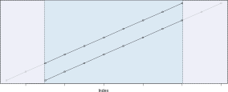

```{r, include = FALSE}
knitr::opts_chunk$set(
  collapse = TRUE,
  comment = "#>"
)
```

```{r setup}
library(ccf21)
```

## Cross Correlations in R

I wanted to use the `ccf` function in a project, but I had a lot of trouble understanding its output. The documentation was quite limited, and even after reading it thoroughly, I still struggled. I had to experiment with the function and take notes to fully grasp how it works. Hopefully, what I learned can help you as well.

## Cross Correlations

`ccf(x, y)` expects two vectors and estimates the correlation between `x[t+k]` and `y[t]`. Typically, we don't specify just one value of `k`. Instead, we vary `k` to observe how the correlations change and identify the value where the correlation is highest or lowest. This is exactly what `ccf()` does.

## `ccf` as implemented in R

**Lagging behind**. I wondered why I was getting so few values in return. When you cross-correlate two vectors, each with 100 values, the result is just 33 values, ranging from `k = -16` to `k = +16`.

The point to consider is the range of lags `k` the function explores. By default, this is set to `10*log10(N/m)`, where `N` is the number of observations and `m` is the number of series. This results in a relatively small lag window. For example, with a sample size of `N = 20`, the lag window covers 50%, meaning cross-correlations are computed from -25% to +25% of the total range. As shown in the plot below, the relative window shrinks as the sample size increases. Though the absolute window grows, in relation to the total length of the sequence, the window shrinks. R seems to prioritize using as much data as possible for its calculations.

You can override this default setting using the `lag.max` argument.

```{r Relative size of lag window, echo=FALSE, fig.width=7}
library(ggplot2)
Lag <- seq(5, 200, 5)
Lag <- data.frame(N = Lag, Win = floor(10*log10(Lag/2)), WinPerc = floor(10*log10(Lag/2))/Lag)
ggplot( Lag, aes(x=N, y=Win)) +
  geom_line() + geom_point() + 
  ylab("Window Size in Samples") +
  geom_point(mapping = aes(x = N, y = WinPerc*25, col = "")) + 
  scale_y_continuous( sec.axis = sec_axis(~ . * 4, name = "Window Size %") ) +
  theme_light() +
  theme(legend.position = "none") + 
  labs(title = "Size of Lag Window", subtitle = "(for 2 Time Series)") +
  xlab("Sample Size (N)")
```

**Time series analysis**. When I finally understood the range better, I began to question the results I was getting. Consider this example:

```{r Simple CCF, fig.width=7}
stats::ccf(1:10, 1:10, plot = TRUE)
```

If I cross-correlate two monotonically increasing sequences, why don’t I get a correlation of `\r = 1` for all time lags? Look at the next image: When we simply correlate two identical, linearly increasing sequences, shouldn’t the correlation always be 1? Well, it depends.

{width="100%"}

The first thing to understand is that `ccf` does not just treat your input as regular vectors — it interprets them as time series. What many introductory explanations of cross-correlation fail to mention are the underlying assumptions that come with this. While cross-correlation is often simplified as the correlation between two sequences shifted relative to one another, there's more to it. Wikipedia covers this issue, but some sources do not (see, for example, [Bourke (1996)](http://paulbourke.net/miscellaneous/correlate/) or the R manual).

One key assumption with time series is stationarity. This means that the process generating the sequence should not change over time, and neither should the variance. This is why `ccf` uses the standard deviations and means of the **entire sequence**, even when calculating the lagged cross-correlation over a limited window.

One might suggest using only the data from each time window to compute the standard deviations, since they are not supposed to change. However, samples inherently introduce random fluctuations. The larger the sample, the more accurate the estimate, which is why R handles it this way. This also explains the odd behavior we see with `ccf(1:10, 1:10)`. In this case, the overall mean is higher than the windowed mean for all `k ≠ 0`. As `k` increases, the values are pulled down, resulting in decreasing cross-correlations at the edges.

This is probably why R selects relatively large windows. The larger the sample relative to the total size, the fewer artifacts we can expect in the cross-correlation results.

```{=html}
<!--
$$ 
r_t = {\sum_{t=max(1,−k)}^{min(N−t,N)} {(x_t - \bar x) \cdot (y_ {t-k} - \bar y)} 
\over 
{\sum_{t=max(1,−k)}^{min(N−t,N)}  {(x_t - \bar x)^2 \cdot \sum_{t=max(1,−k)}^{min(N−t,N)} (y_ {t-k} - \bar y)^2}}}
$$
-->
```

### Confidence

You may have noticed the blue lines in the cross-correlation plot above — these represent the confidence intervals. If you use a sequence with the same distribution but more samples, the intervals will become narrower. However, the manual advises caution with this, which is a little strange because `ci.type = "white"` is the default. In essence: do not trust the default. This setting simply adds confidence intervals based on quantiles of the standard normal distribution, without considering the specific statistical properties of your data. The manual suggests using `ci.type = "ma"` instead, but it appears this option can't be applied to cross-correlations. If you try, you'll get a warning: "can use ci.type='ma' only if first lag is 0." This method only works for auto-correlations (`acf`), where the window doesn't shift from `-k` to `+k` and the first lag can be zero — something `ccf` does not support.

**Output**. In addition to the plot, `ccf` returns a list (of class `acf`) with the following elements:


**Confidence**. You may have noticed the blue lines in the cross-correlation plot above. These give you the confidence intervals. Choose a sequence with the same distribution and more samples, it will become smaller. The manual recommends caution with that, even though `ci.type = "white"` is the default setting. It bluntly adds some confidence based on the quantiles of a standard normal distribution but it does not take the statistical properties of your data into account. Instead it recommends `ci.type = "ma"`. If I understand it correctly, we cannot use this type for cross-correlations. If you try it, you will get a warning saying "can use ci.type="ma" only if first lag is 0". It only seems to work for auto-correlations with `acf`. This function does not move the window from -k to +k and will allow the first lag to be zero. `ccf` does not.


|        |                                             |
|:-------|:--------------------------------------------|
| lag    | A three dimensional array containing the lags at which the cross-correlation is estimated.                                                   |
| acf    | An array with the same dimensions as lag containing the estimated cross-correlation. See below.                                              |
| type   | The type of correlation (same as the type argument).                                                                                         |
| n.used | The number of observations in the time series.                                                                                               |
| series | The name of the series x. For cross-correlations always `X` and, thus, uninformative.                                                        |
| snames | The series names for a multivariate time series. This is simply the name of the variable or the command that you used when you called `ccf`. |

This class is used for both, auto- and cross-correlations. The name of the list element `acf` is one of the peculiarties that come alone with that. Therefore, `ccf` creates a 3-dimensional array, so that the object is consistent with `acf` results. The cross-correlations are stored in `acf[,,1]`. The first two dimensions are not needed for cross-correlations. We can just ignore them.

Look up the lags in the same way.

**Sequence length**. The element `n.used` in the `acf`-object gives you the sample size that was used in the computation of the cross-correlation. Usually, this will just be the length of the input vectors. You can, however, pass vectors with different lengths to `ccf`. In this case, `n.used = min(length(x), length(y))` because the function ignores all values that exceed the smaller length. Why it does it that way, I do not know. It could move the smaller sequence from the left to the right completely covering the longer sequence.

{width="100%"}

What happened is this:

```{r Binding time series}
# Bind time series restricting to the time covered by all the series.
ts.intersect(as.ts(1:10), as.ts(1:5))
```

That is one of the instructions we can find in the upper part of the ccf-function. It prepares the data in order to pass it on to another function that does the actual job. As you can see, R simply cuts off the longer sequence. What you want to get is `ccf(1:10, 1:5)`. What you actually get is `ccf(1:5, 1:5)`. The task of `ts.intersect()` is to combine the two sequences to a data frame. All columns of a data frame must have the same length and R must decide whether to cut one sequence (`ts.intersect()`) or to fill the shorter sequence with a dummy value (`ts.union()` uses `NA`).

What we can learn from the above is how closely `acf()` and `ccf()` are related. What more or less happens when we call `ccf()` is:

```{r pre, include=FALSE}

```
```{r acf vs ccf, echo=-(1:2), fig.width=7}
op <- par()
par(mar = c(1, 1, 1, 1))
stats::acf(ts.intersect(as.ts(1:10), as.ts(1:5)))
```
```{r post, include=FALSE}
par(op); rm(op)
```

This organises the results in a different way, but they are essentially the same. The upper left and lower right quadrant show the auto-correlations. The cross-correlations are divded into two panels. The lower left panel shows cross-correlation at negative time lags, the upper right panel shows the positive lags.

I had the hope that we can use this way to get proper confidence intervals for cross-correlations. Unfortunately, we get confidence only for auto-correlations. If anyone can explain the reason, I would be happy to add it here but I do not know one.

## Summary

It was a hard piece of work to put all this together. The fact that R handles cross- and auto-correlations with the same set of function adds unnecessary complexity. I understand that these may use the same underlying code but usage should not be affected by it. Unfortunately, the documentation does not reduce the complexity through information. It could be improved. So could the messages. If anyone from the R team reads this, contact me if you are interested in my suggestions.


## References & Further Reading

Bourke, P. (1996). [Cross Correlation: AutoCorrelation -- 2D Pattern Identification](http://paulbourke.net/miscellaneous/correlate/).

Venables, W.N., & Ripley, B.D. (2002). [Modern Applied Statistics with S](https://www.springer.com/gp/book/9780387954578). Fourth edition.

Gunther, N. (2014). [Melbourne's Weather and Cross Correlations](https://www.r-bloggers.com/melbournes-weather-and-cross-correlations/). [R-bloggers](https://www.r-bloggers.com/)

------------------------------------------------------------------------

## Session Info

```{r}
print(sessionInfo(), local = FALSE)
```
